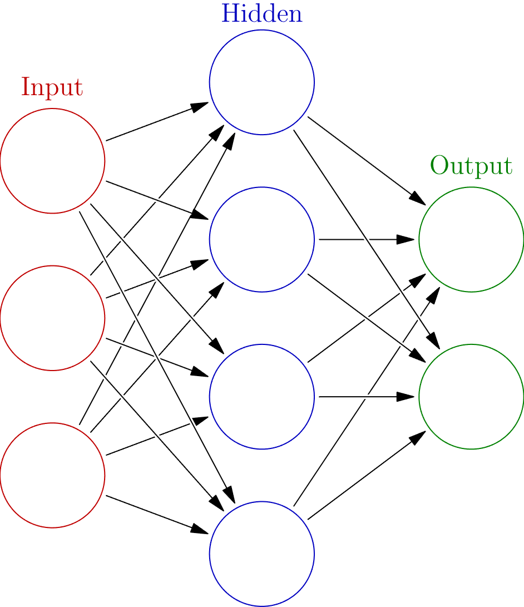
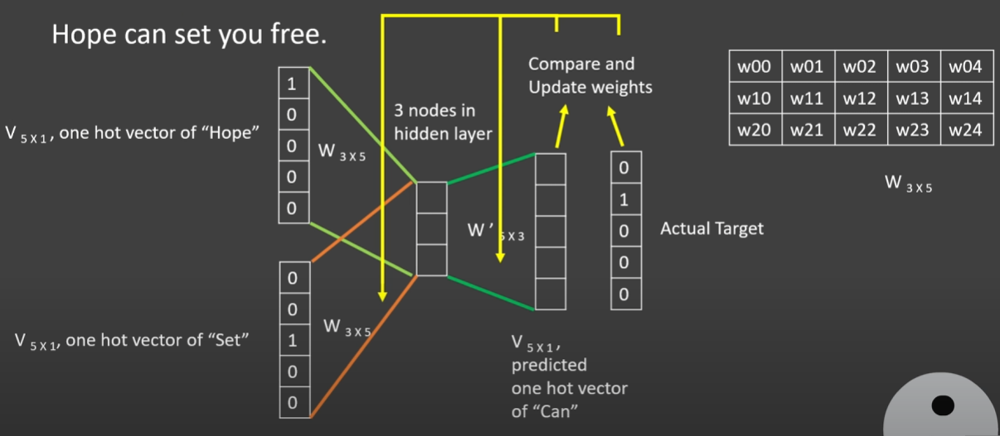
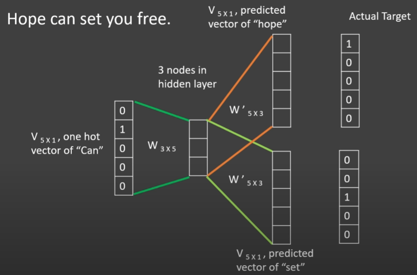

## Feed-Forward Neural Networks

### Topology

- made up of layers
    - input layer
    - hidden layer(s)
    - output layer

    

- data flows one way (as opposed to recurrent networks which allow bidirectional flow)
- nodes perform non-linear functions on their inputs and output a real number (**Activation Function**)
- signal strength is controlled by a weight at each connection

### Hyperparameters

### Activation Functions

- function performed by a node upon receiving signal(s)

### Training, Backpropogation

## Recurrent Neural Network

> As the hidden size approaches infinity, will the behavoir of an RNN approach that of a FFNN?

### Topology

> Minsky and Paper pointed out that recurrent networks can be unrolled in time into a layered feedforward network.[23]: 354 (https://en.wikipedia.org/wiki/Recurrent_neural_network)

- contains loops allowing memory
- good at sequential tasks where previous inputs affect the output


```python
rnn = RNN()
ff = FFN()
hidden_state = [0.0, 0.0, 0.0, ..., 0.0]

for item in input:
    output, hidden_state = rnn(item, hidden_state)

prediction = ff(output)
```
- short term memory (vanishing gradient)
    - long short-term memory (LSTM)
        - uses gates to remember relevant information and forget others
    - gated recurrent unit (GRU)
        - update gate
        - reset gate
        - less tensor operations than LSTM

### Training

- backpropogation
- short term memory

### Notes

- consider keeping stop words, emoji's, etc.
- 2 classes for positive and negative
- unweighted accuracy
- threshold
- reverse chunks of reviews
- text augmentation
- fully connected layer after LSTM
- unweighted accuracy
- keep softmax

## Word Embeddings

### One-hot encoding
$$
w = \overbrace{\left[ 0, 0, \dots, 1, \dots, 0, 0 \right]}^\text{|V| elements}
$$

- each word $w$ is represented by a one-hot vector
- the draw back besides the huge size is each word is treated independently with **no relation to each other**

### Dense word embeddings

If we created dense vectors that captured some semantic attributes of the words, for example:

$$
q_\text{nick} = \left[ \overbrace{3.3}^\text{likes table tennis}, \overbrace{-9.4}^\text{is a professor}, \overbrace{-7.5}^\text{married}, \dots \right]
$$

$$
q_\text{hynek} = \left[ \overbrace{6.5}^\text{likes table tennis}, \overbrace{9.1}^\text{is a professor}, \overbrace{6.4}^\text{married}, \dots \right]
$$

we could measure similarity between words by:

$$
\text{Similarity(physicist, mathematician)} = q_{\text{physicist}} \cdot q_{\text{mathematician}}
$$

or even better,

$$
\text{Similarity(physicist, mathematician)} = \frac{q_{\text{physicist}} \cdot q_{\text{mathematician}}}{\|q_{\text{physicist}}\| \|q_{\text{mathematician}}\|} = \cos{\phi}
$$

Where $\phi$ is the angle between the word vectors. Similar words will have a similarity of 1 and dissimilar words will have a similarity of -1.

Neural networks can learn these *latent semantic attributes* through the assumption that like words will appear close together.

> Further reading: transformers (BERT, GPT), contextual word embeddings (ELMo), attention mechanisms (T5, BART), GloVe, FastText, doc2vec

### Word2vec

Creates vector representations of words based on surrounding text from a large corpus. Word2vec is a collection of related models used to produce word embeddings. These models are shallow, two-layer networks. Word2vec uses two model architectures:

- Continuous bag of words (CBOW)
- Skip-gram

CBOW is like a 'fill in the blank' test where a fixed sized window surrounding a target word is used to predict the target word.



Skip-gram is the reverse; the context words are predicted from the target word



#### Summary

- **How it works?**
    - Produces dense vector representations (embeddings) of words using CBOW or skip-gram architecture. CBOW predicts a target word from context while skip-gram predicts context words from a target word
- **How was it trained?**
    - Large corpus of text, defined window size, maximizing probability of context/target prediction
- **What is the input?**
    - **1 word at a time?**
        - For skip-gram, 1 word is fed in and the context words are predicted. For CBOW, the context is fed in and a single word is predicted
    - **Representations of the word(s) at the input?**
        - One-hot vector or integer encoding (map)
    - **BoW?**
        - I don't remember what this question meant
- **Output?**
    - Both skip-gram and CBOW will produce an embedding matrix that can be used directly to compute similarities or as input for downstream neural networks
    - Skip-gram will produce context given a target word
    - CBOW will produce a target word given a context

Word2vec has a potential downside in that it cannot be used for out-of-vocabulary (OOV) words, meaning if the training corpus did not include a specific word, there will not be a generated embedding. FastText uses a similar idea to skip-gram called $n$-gram's. The idea is each word is treated as a composition of $n$-grams. For example, using an $n$ value of 3, the word 'pizza' would have an $n$-gram representation of '<pi, piz, izz, zza, za>' where '<' and '>' signify the start and end of the token. Embeddings for OOV words are generated by averaging the $n$-gram's making up the OOV word. The drawback to FastText is the high memory requirement since embeddings are created from characters not words.

Word2vec is considered outdated in favor of transformers.

## FastText

- how are inputs organized? padded? LSTM?

"We distribute pre-trained word vectors for 157 languages, trained on Common Crawl and Wikipedia using fastText. These models were trained using CBOW with position-weights, in dimension 300, with character n-grams of length 5, a window of size 5 and 10 negatives. We also distribute three new word analogy datasets, for French, Hindi and Polish."


subword of 'refrigerator':

(['refrigerator', '<ref', 'refr', 'efri', 'frig', 'rige', 'iger', 'gera', 'erat', 'rato', 'ator', 'tor>'], array([   6315, 3998276, 
3822544, 3278539, 2069117, 3246884, 3006258,
       3159920, 2716211, 3195125, 3616757, 3672916]))


### Precision Recall

Consider a computer program for recognizing dogs (the relevant element) in a digital photograph. Upon processing a picture which contains ten cats and twelve dogs, the program identifies eight dogs. Of the eight elements identified as dogs, only five actually are dogs (true positives), while the other three are cats (false positives). Seven dogs were missed (false negatives), and seven cats were correctly excluded (true negatives). The program's precision is then 5/8 (true positives / selected elements) while its recall is 5/12 (true positives / relevant elements).